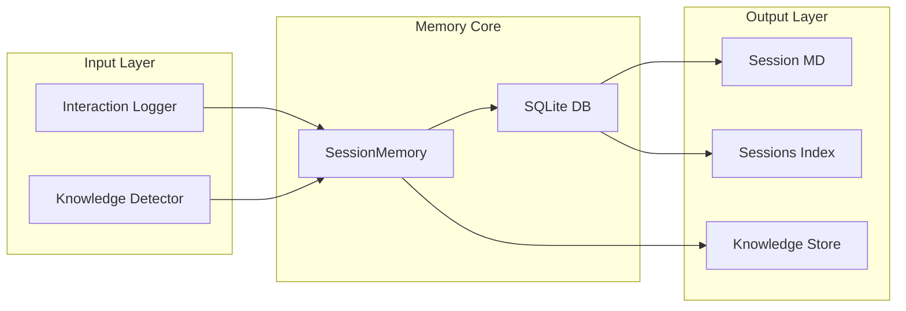

# Memory System Architecture

> **Versión**: v2.0.0 | **Backend**: SQLite | **Pattern**: Session-based persistence

---

## 🏗️ Architecture



---

## 📋 SessionMemory API

```python
from core.memory.session_memory import SessionStore, Session, SessionMessage

# Get default store (singleton)
store = get_default_store()

# Session lifecycle
session = store.get_or_create("session-2026-04-19")
session.mark_active()
session.mark_closed()

# Message handling
store.add_message(session_id, "user", "Hello")
store.add_message(session_id, "assistant", "Response")

# Query
recent = store.get_recent_sessions(limit=10)
messages = store.get_messages(session_id)
```

---

## 🗃️ SQLite Schema

```sql
-- sessions table
CREATE TABLE sessions (
    id TEXT PRIMARY KEY,
    created_at TIMESTAMP,
    closed_at TIMESTAMP,
    status TEXT,  -- 'active', 'closed'
    metadata JSON
);

-- messages table  
CREATE TABLE messages (
    id INTEGER PRIMARY KEY,
    session_id TEXT,
    role TEXT,  -- 'user', 'assistant', 'system'
    content TEXT,
    timestamp TIMESTAMP,
    FOREIGN KEY (session_id) REFERENCES sessions(id)
);
```

---

## 🔄 Persistence Flow

| Stage | Action | Storage |
|-------|--------|---------|
| Create | `get_or_create()` | SQLite sessions table |
| Active | `add_message()` | SQLite messages table |
| Autosave | Sync to MD | `sessions/session-*.md` |
| Close | `mark_closed()` | SQLite + sessions-index.json |

---

## 📁 Storage Locations

| Data | Path | Purpose |
|------|------|---------|
| SQLite DB | `core/.context/memory/sessions.db` | Primary persistence |
| Session MD | `core/.context/sessions/session-*.md` | Human-readable logs |
| Sessions Index | `core/.context/knowledge/sessions-index.json` | Fast lookup |
| Knowledge | `core/.context/knowledge/` | Extracted patterns |

---

## 🛡️ Error Handling (FASE 2 Fix)

```python
# KeyError prevention in interaction_logger.py
stats = session_data.get("stats", {})
agents = stats.get("agents", [])  # .get() with default

# NOT:
agents = stats["agents"]  # KeyError if missing
```

---

*See also: [Session Flow](session-flow.md), [KeyError Stats](../troubleshooting/keyerror-stats.md)*