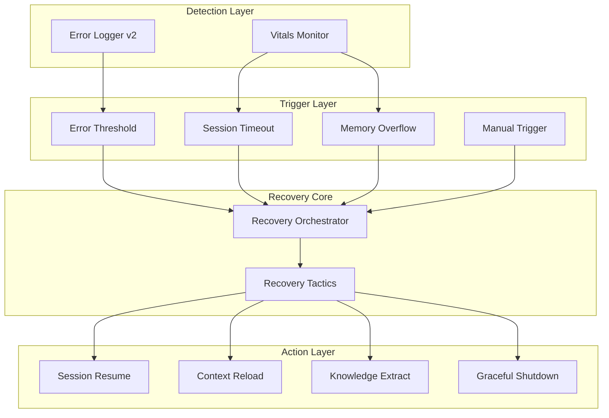

# Recovery System Architecture

> **Versión**: v1.0.0 | **Taxonomy**: ADR-004 | **Pattern**: Trigger-based recovery

---

## 🏗️ Architecture



---

## 📋 Recovery Triggers

| Trigger | Condition | Priority |
|---------|-----------|----------|
| Session Timeout | No activity > 30min | LOW |
| Error Threshold | >5 errors in session | MEDIUM |
| Memory Overflow | SessionMemory > 100MB | HIGH |
| Manual Trigger | User request `--recover` | CRITICAL |

---

## 🔄 Recovery Tactics

### ADR-004 Taxonomy

```yaml
recovery_tactics:
  - id: RT-001
    name: session_resume
    description: "Resume interrupted session"
    actions:
      - load_session_context
      - restore_interaction_state
      - continue_from_last_checkpoint
      
  - id: RT-002
    name: context_reload
    description: "Reload Tier 0-4 context"
    actions:
      - clear_stale_context
      - reload_from_context_loader
      - validate_tier_integrity
      
  - id: RT-003
    name: knowledge_extract
    description: "Extract patterns from session"
    actions:
      - run_knowledge_detector
      - persist_to_knowledge_store
      - update_sessions_index
      
  - id: RT-004
    name: graceful_shutdown
    description: "Clean session end"
    actions:
      - run_autosave
      - mark_session_closed
      - cleanup_temp_files
```

---

## 🛡️ Error Logger v2

```python
# core/logging/error_logger.py
class ErrorLogger:
    def log_error(self, error: Exception, context: dict):
        entry = {
            "timestamp": datetime.now().isoformat(),
            "error_type": error.__class__.__name__,
            "error_msg": str(error),
            "context": context,
            "recovery_suggested": self._suggest_recovery(error)
        }
        self.errors.append(entry)
        
        # Trigger recovery if threshold
        if len(self.errors) > 5:
            self.trigger_recovery("error_threshold")
```

---

## 📁 Related Files

| File | Purpose |
|------|---------|
| `core/recovery/orchestrator.py` | Main recovery coordinator |
| `core/recovery/triggers.py` | Trigger definitions |
| `core/logging/error_logger.py` | Error capture + taxonomy |
| `core/scripts/vitals_monitor.py` | Health checks + overflow detection |

---

*See also: [Session Flow](session-flow.md), [Memory System](memory-system.md)*