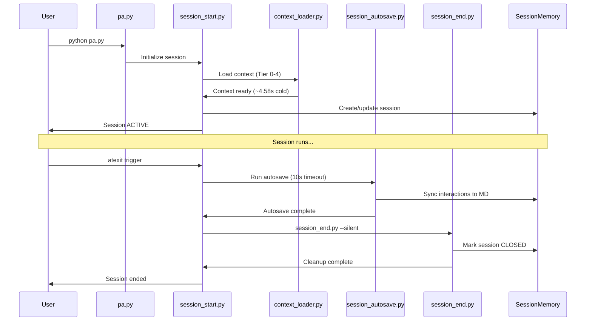

# Session Flow Architecture

> **Versión**: v2.2.0 | **Critical Path**: Startup → Autosave → Shutdown

---

## 🔄 Flow Diagram



---

## 📋 Sequence Details

### 1. Startup (session_start.py)

| Step | Action | Duration |
|------|--------|----------|
| 1 | Check active session | <0.1s |
| 2 | Initialize ContextLoader | ~0.5s |
| 3 | Lazy load Tier 0-4 | ~4s cold / <2s warm |
| 4 | Create SessionMemory entry | <0.1s |
| 5 | Register atexit handlers | <0.01s |

### 2. Autosave (session_autosave.py)

| Step | Action | Timeout |
|------|--------|---------|
| 1 | Read interactions/*.jsonl | 5s |
| 2 | Parse Log de Actividades | 2s |
| 3 | Update session MD file | 3s |
| 4 | Sync to SessionMemory | Instant |

**Critical**: Autosave runs BEFORE session_end.py to ensure interactions are persisted.

### 3. Shutdown (session_end.py)

| Step | Action | Error Handling |
|------|--------|----------------|
| 1 | Mark session closed | Try/except OSError |
| 2 | Update sessions-index.json | Silent fail on Windows |
| 3 | Migrate pendientes | Backup on error |
| 4 | Cleanup temp files | Ignore missing |

---

## 🛡️ Windows I/O Protection

```python
# session_start.py shutdown handler
def session_shutdown():
    try:
        # Autosave FIRST
        subprocess.run([sys.executable, "session_autosave.py"], capture_output=True, timeout=10)

        # Then session_end
        subprocess.run(
            [sys.executable, "session_end.py", "--silent"],
            capture_output=True,
            timeout=30,
        )
    except (ValueError, OSError, subprocess.TimeoutExpired):
        # Expected shutdown-only errors on Windows
        pass
```

**Pattern**: `capture_output=True` prevents `ValueError: I/O operation on closed file` on Windows.

---

## 📁 Related Files

| File | Purpose |
|------|---------|
| `core/scripts/session_start.py` | Bootstrap + atexit registration |
| `core/scripts/session_autosave.py` | Interaction sync to session MD |
| `core/scripts/session_end.py` | Session closure + cleanup |
| `core/memory/session_memory.py` | SQLite persistence layer |

---

*See also: [Memory System](memory-system.md), [Windows I/O Errors](../troubleshooting/windows-io-errors.md)*